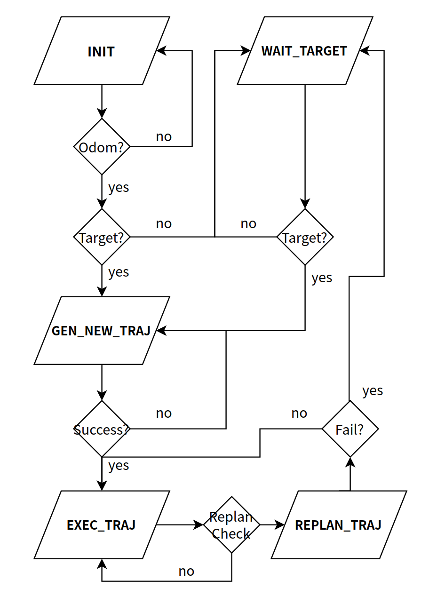
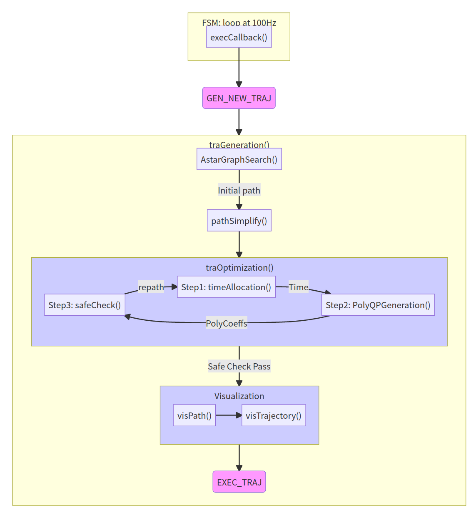
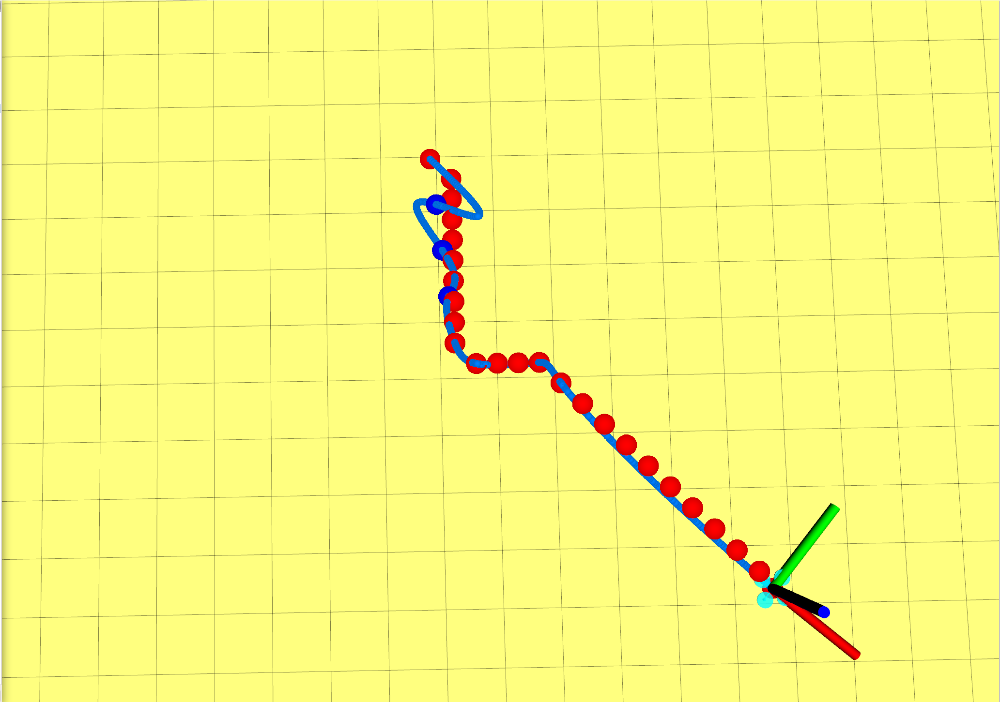
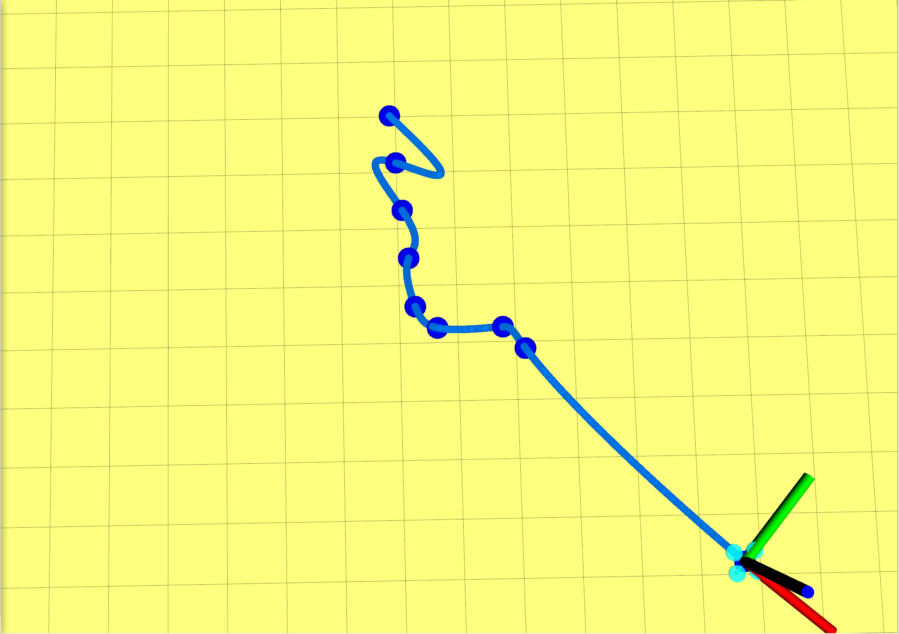
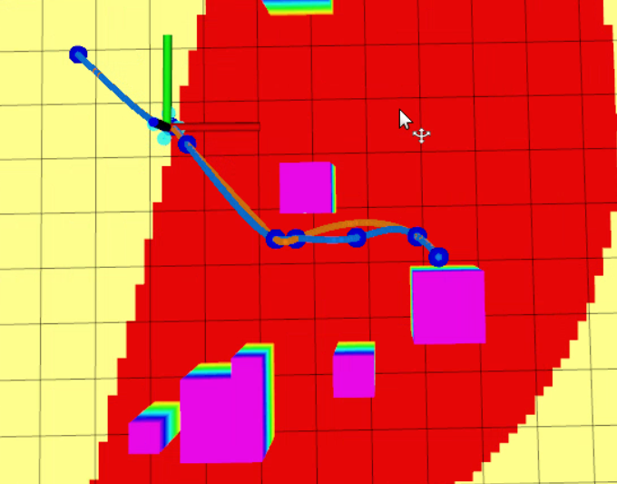
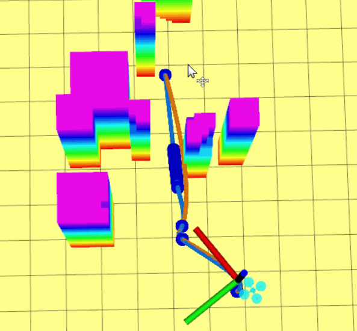

# 移动机器人运动规划课程大作业

该项目为深蓝学院"移动机器人运动规划"课程大作业。大作业涉及如下方面：

* 路径搜索
* 轨迹生成
* 轨迹重优化
* 由传感器范围有限所导致的重规划

## 1.安装

安装系统依赖
```
sudo apt-get install cmake libopenblas-dev liblapack-dev libarpack-dev libarpack2-dev libsuperlu-dev
```

安装Armadillo
```
xz -d armadillo-9.870.2.tar.xz
tar -xvf armadillo-9.870.2.tar
cd armadillo-9.870.2
mkdir build
cd build
cmake ..
make
sudo make install
```

## 2.程序框架关键部分

### 2.1无人机运动规划有限状态机设计
&emsp;&emsp;无人机的运动规划系统主要分为五个状态: *INIT, WAIT_TARGET, GEN_NEW_TRAJ, EXEC_TRAJ, REPLAN_TRAJ*,意即系统初始化、等待目标点、生成新轨迹、执行轨迹和重规划轨迹。
&emsp;&emsp;生成新轨迹和重规划轨迹的代码流程基本一致，只不过后者是为保障传感器范围受限的无人机飞行安全而设计的定期重规划状态。
&emsp;&emsp;运动规划系统在启动后，仅当收到里程计信息时，状态才会从INIT切换为WAIT_TARGET；当系统接收到目标点后才会进一步切换至GEN_NEW_TRAJ,开始执行主要规划流程。execCallback()是系统内定期（100Hz）执行的回调函数，也是执行运动规划代码的入口所在之处。它主要通过检查某些标志位全局变量，如：has_odom，has_target等来决定系统状态。状态切换的具体细节和逻辑如下面的流程图所示：
<p align='center'>

</p>

### 2.2 运动规划主要流程
&emsp;&emsp;无人机的运动规划系统主要分为前端可行路径搜索，和后端轨迹生成与优化。在本项目中前端主要采用A*算法，并以对角线距离设计启发式函数。后端则采用满足Minimum Jerk的五次多项式曲线对路径点进行拟合。
&emsp;&emsp;此外，采用RDP算法对Astar算法搜索出来的路径点进行简化，避免了对过多的路径点插值计算，减少运算规模和时长；
&emsp;&emsp;采用Conservative Advance方法对多项式曲线各分段上各点的安全性进行检测，若某分段不满足要求则在其中插入中间点进行重新拟合，这也基本是本代码后端优化的主要流程。
&emsp;&emsp;trajectory_generator_node.cpp里的traGeneration()函数包含了运动规划的主要流程，其主要在execCallback()中被调用。下面的流程图展示了函数traGeneration()的主要结构和各功能之间的调用关系。
<p align='center'>

</pr>

*注：timeAllocation()是基于梯形速度曲线来分配时间的*

## 3.主要结果展示

### 3.1 A*搜索路径简化前后对比

<p align='center'>
<div align=half>


</div>
</p>

*说明：轨迹与Astar搜索路径在开头段不贴合，主要原因是这段轨迹是中间重规划生成的，轨迹起点处初速度不为零。*

&emsp;&emsp;通过对比左右两图可见（红点为Astar搜索路径，蓝点为RDP算法简化后的路径），RDP算法将原始A
star路径点简化为少数几个关键点。

### 3.2 trajecotry reoptimization前后的可视化比较

<p align='center'>
<div align=half>


</div>
</p>

&emsp;&emsp;如图所示，橙色轨迹为未经safeCheck的轨迹，蓝色则为经过重优化的实际执行轨迹。
&emsp;&emsp;某些情况下只需经过少数中间插点，即可将轨迹拉回无碰撞空间（上图）；但某些情况则需经过多次插点，才能保证轨迹无碰撞（下图）

### 3.3 无人机运动规划动图演示

<p align='center'>

play speed 2X
</p>
## 4.主要问题分析

- A*搜索算法只能保证可行性和最优性，并未考虑无人机的动力学约束特性，导致拟合的轨迹并不光顺，且与障碍物过于贴近。
- RDP算法epsilon值决定了路径点的简化程度。epsilon过大不仅会导致后端safeCheck()被反复调用，影响计算效率，也会影响在密集障碍物区域的避障性能
- trajectory reoptimization为保证每段轨迹的安全性，有可能会不断插入中间点，有时会面临插入点过多，导致计算效率大大下降；而且对应分段因为插入点过多，无人机飞行速度会非常缓慢。
- 本代码的后端没有考虑与障碍物之间距离因素，只能保证路径可行性，离安全应用还有很大的改进空间


**！！！完结撒花，感谢我导对我学习运动规划课程的鼓励和大力支持，也感谢深蓝学院提供的高质量课程，让我收获颇丰！课程的结束，意味着新的征程即将开始，希望我能有朝一日独立完成无人船运动规划框架的搭建！！！**
<p align='center'>

  <p>
