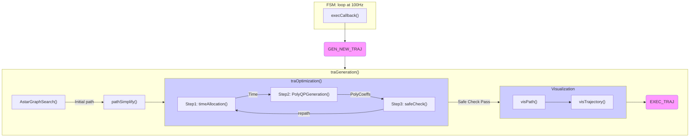

```mermaid
flowchart TD
subgraph FSM: loop at 100Hz
O["execCallback()"]
end
subgraph id1["traGeneration()"]
A["AstarGraphSearch()"]--Initial path-->B["pathSimplify()"]
subgraph id2["traOptimization()"]
direction LR
    D["Step1: timeAllocation()"]--Time-->F["Step2: PolyQPGeneration()"]--PolyCoeffs-->G["Step3: safeCheck()"]
    G--repath-->D
end
id2--Safe Check Pass-->id3-->J(EXEC_TRAJ)
subgraph id3["Visualization"]
direction LR
I["visPath()"]-->K["visTrajectory()"]
end
B-->id2
end
O-->E(GEN_NEW_TRAJ)-->id1
style E fill:#f9f
style J fill:#f9f
style id2 fill:#ccf
style id3 fill:#ccf
```